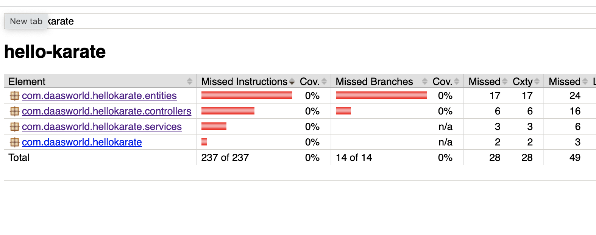

# Problem 
Demoing Jacoco is not picking up karate test result

Steps
1. Fresh clone from https://github.com/Sdaas/hello-karate
2. Delete the existing unit test (we want the coverage from Karate)
3. Add the Jacoco dependency into pom.xml
4. Start the project with `mvn spring-boot:run`
5. On a separate terminal, run `mvn clean test`

Jacoco See the Karate test (otherwise will get Getting Skipping JaCoCo execution due to missing execution data file) but no coverage
